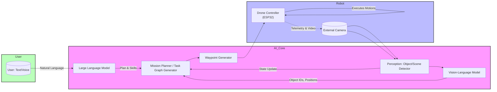
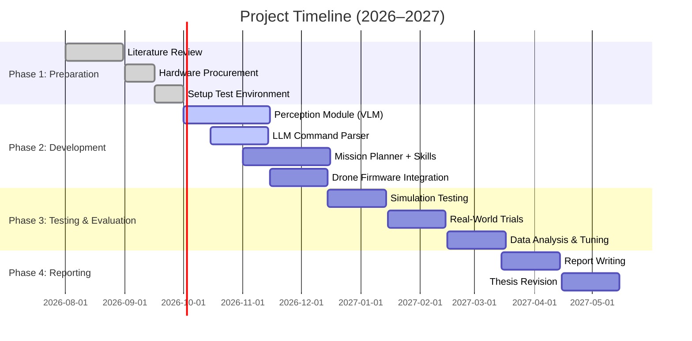

# Executive Summary

This proposal outlines **“Natural Language Adaptive Drone Framework”** – an embodied AI system that uses Large Language Models (LLMs) and Vision-Language Models (VLMs) to interpret high-level human commands and autonomously execute drone missions indoors. Unlike typical drone projects that hard-code behaviors or rely on joystick control, our drone will accept *open-ended instructions* (e.g. **“Circle the red bottle”** or **“Fly in a square”**), reason about the task using an LLM, perceive the environment with a VLM (via an external camera), plan a sequence of waypoints/skills, and continually adapt based on visual feedback. The **novelty** lies in the software architecture: LLMs handle language-based task planning, VLMs handle perception, and a feedback loop integrates both for real-time replanning. The hardware is minimal (one ESP32-based drone + camera) to keep costs down, allowing us to focus on cutting-edge AI integration.  

Our literature review finds that recent work has begun to apply LLMs/VLMs to UAVs (e.g. *LUNASM*, *multimodal AI-HMC*) and to human-robot collaboration in general. However, most existing studies either simulate complex scenarios or use advanced drones (e.g. DJI with smartphone) and target specialized tasks (e.g. inspection, swarm control). We identify a gap: **low-cost, single-drone demonstrations of language-guided missions in indoor environments** are lacking. Our project will fill this gap by designing a lightweight modular framework that can be experimentally validated on affordable hardware.  

Below, we present a detailed literature survey (Table 1), outline our system architecture (Fig. 1), compare hardware options (Table 2), propose software modules (perception stack, mission planner, etc.), and detail an evaluation plan (Table 3) with metrics such as task success rate and replanning frequency. A Gantt chart (Fig. 2) and budget table (Table 4) illustrate the 6–9 month plan and resource needs. All hardware and software components are chosen to fit a modest student budget (₹3k–₹4k for the drone, plus a camera and compute). The result will be a **proof-of-concept adaptive drone** that showcases how LLM/VLM “brains” can control real robots, suitable for a final-year thesis and potential publication.

---

## 1. Background & Motivation

**Embodied AI** aims to endow robots with human-like understanding by combining perception and language. Modern LLMs (e.g. GPT-4) and VLMs (e.g. CLIP, BLIP) have shown powerful reasoning and vision-language grounding on static tasks. Integrating these into robotics has enabled new capabilities: robots can interpret language to plan complex tasks or generate plans in real time. However, most robotics work has focused on arms or ground vehicles. 

**For drones,** the idea of natural-language missions is just emerging. Recent surveys and systems highlight the promise of LLMs/VLMs in UAVs. For example, Gamage *et al.* (2025) built *LUNASM*: an LLM-based navigation system in ROS/Gazebo achieving ~79% success on complex simulated tasks. Krupáš *et al.* (2025) demonstrated a real drone using GPT-4 (cloud) and a vision model (MiDaS) to navigate around obstacles, achieving 50–70% success. These works confirm feasibility but rely on high-end drones and computation. 

**Gap / Novelty:**  In contrast, we aim to show that even a **single, simple ESP32 drone** can become “smart” with LLM/VLM planning. Our key contribution is a **modular framework** that cleanly separates: (1) **Language interpretation** (LLM), (2) **Perception (VLM)**, (3) **Mission planning**, and (4) **Drone control**, with a closed-loop for feedback and replanning. This is analogous to recent surveys’ calls for integrated pipelines. We will benchmark this approach on tasks like *pattern flight*, *object following*, and *inspection*, and compare against fixed scripts. This addresses a clear research question: *“Can a consumer-grade drone execute arbitrary spoken goals via LLM+VLM-based planning?”* Our project thus targets the intersection of **Embodied Multimodal AI** and **affordable robotics**, with clear undergraduate scope.

---

## 2. Literature Review

Table 1 summarizes recent work in language-guided robotics, emphasizing UAVs and related embodied tasks.

| **Paper (Year)**                         | **Contribution**                                                                                                                        | **Relevance**                                                                                               |
|------------------------------------------|-----------------------------------------------------------------------------------------------------------------------------------------|-------------------------------------------------------------------------------------------------------------|
| **Krupáš *et al.* (Electronics, 2025)**  | Integrated VLM-powered reasoning and GPT-4-based planning in a real drone; generates NL commands and explanations for navigation. | Demonstrates combining VLM (perception/depth) with LLM for obstacle-aware UAV navigation and user trust.     |
| **Gamage *et al.* (ICRCV, 2025)**        | *LUNASM*: LLM (GPT-4o) processes NL commands into waypoint-based paths; validated in ROS/Gazebo (smart factory). 95.7% command accuracy, 79% task success. | Shows LLM-based parsing to flight plans in simulation; relevant architecture and metrics (accuracy, success). |
| **FlyAI (CEUR WS, 2023)**               | Prototype system using ChatGPT: maps NL to “pseudo-commands” then switch-case to DJI SDK. Handles simple flight tasks (takeoff, move, land). | Illustrates parsing LLM output into drone API calls; highlights command design pattern and modularity.        |
| **TypeFly (arXiv, 2023)**               | Introduced *MiniSpec*, a token-efficient DSL for real-time LLM->drone control, reducing latency by 62%. Lightweight code generation. | An example of low-latency LLM use for UAV; relevant for on-the-fly control generation (adaptive missions).    |
| **Emami *et al.* (arXiv, 2026)**         | Survey on LLMs for UAVs: taxonomy of LLM use in planning, communications, safety. Highlights examples like SPINE, FlockGPT, NELV; notes most work on isolated modules. | Provides context on current LLM/UAV research; emphasizes planning roles and lack of unified end-to-end systems. |
| **Zhong *et al.* (NeLV, arXiv, 2025)**   | *NeLV*: Proposes next-gen LLM-based pipeline. Uses LLM only as parser for routes; actual planning with PSO/GA. Explains use of PSO for path planning (Eqns. (4)-(6)). | Illustrates hybrid use: LLM for instruction parsing, classical algorithms for path planning.                  |
| **Chen *et al.* (arXiv, 2026)**         | Survey on UAV-VLN (Vision-Language Navigation): defines tasks where UAVs interpret human commands in 3D, surveys benchmarks and challenges (sim-to-real gap). | Frames our work as part of “UAV-VLN”, emphasizing the need for integrated perception-reasoning-control pipelines. |
| **Driess *et al.* (ICML, 2023)**        | *PaLM-E*: Embodied Transformer (540B) fusing vision, sensors, language into robot actions. Achieved >90% success on manipulation tasks; uses chain-of-thought reasoning. | Landmark in generalist embodied AI. Inspires our framework (LLM reasoning + sensor input) though PaLM-E is too large for us. |
| **Other VLM works:** BLIP, CLIP, etc.   | Vision-language models enabling open-vocab detection and reasoning.                                                        | We will leverage open-source VLMs (e.g. CLIP or LLaVA) for perception, following trends in embodied AI.       |

> **Insight:** These works show that LLM/VLM can plan and interpret navigation tasks, but often at high cost or in simulation. Notably, Krupáš *et al.* and Gamage *et al.* demonstrate feasibility with real/physical drones. Our approach will adapt their high-level ideas (LLM planning, VLM perception) but on a low-cost ESP32 drone, addressing a practical “implementation gap.” 

**Research Gaps:** Existing literature often either uses powerful drones/compute or focuses on swarms and networked systems. There is relatively little on *learning-based, single-drone, low-budget implementations*. Also, many systems have tightly coupled stacks (e.g. DJI+phone), whereas we aim for a modular pipeline where LLM and VLM components run externally and interface via a simple API. Finally, few works explicitly address **failures and replanning**; we will design experiments to test robustness (e.g. removing waypoints mid-flight) and compare with static plans. 

---

## 3. System Architecture

Our system (Fig. 1) is divided into four layers: **(1) Language Understanding (LLM)**, **(2) Perception (VLM)**, **(3) Mission Planning**, and **(4) Drone Control / Execution**, with a closed-loop feedback.

**Figure 1:** *System Architecture for Adaptive Drone*. The user issues an open-ended command (speech/text). The **LLM** (e.g. GPT-4o or LLaVA) interprets intent and decomposes it into subtasks and a high-level plan (a “skill graph”). The **Vision-Language Module (VLM)** processes images from a fixed overhead camera to detect objects (e.g. bottle, box) and their coordinates. The **Mission Planner** integrates the LLM plan and visual observations, then generates waypoints or motion primitives (e.g. “move forward 1m”, “circle (x,y)”). These are sent to the **Drone Control** (ESP32-based) which executes low-level flight. The drone continually sends back status/video; the camera tracks the scene, and the loop repeats until the goal is achieved or replanning is needed.

This design emphasizes **modularity**. For example, the LLM never commands raw motor speeds—it only outputs task-level steps or waypoints. The mapping from LLM output to drone commands can use a rule-based parser (as in FlyAI) or a parameterized API. The perception uses a VLM (e.g. open-source CLIP/LLaVA or Off-the-shelf detection) to provide semantic understanding (e.g. color, shape) beyond raw pixel data, following trends in recent works.

We will implement core robot “skills” (takeoff, land, move_x, circle, etc.) on the ESP32 firmware (likely leveraging Crazyflie’s Python API) and allow the Planner to sequence them. Each skill has termination conditions (e.g. reach target) to signal back. Importantly, the Planner can insert replanning steps: if the drone reports a failure or the VLM detects a new obstacle, the LLM can be invoked again (potentially with updated context) to adjust the plan.

---

## 4. Hardware Comparison: LiteWing vs Anu ESP32 Drone

We considered two low-cost ESP32-S3-based drones (within ₹3k–₹4k): **LiteWing ESP32-S3 (Ready-to-Fly)** and **Anu Electronics ESP32-S3 Drone Kit**. Both share very similar specs (ESP32-S3 MCU, MPU6050 IMU, 4 brushed motors, H-bridge drivers, PCB frame). Table 2 compares them:

| **Feature**                        | **LiteWing ESP32-S3 (Ready-to-Fly)**            | **Anu Electronics ESP32-S3 (DIY Kit)**       |
|------------------------------------|-------------------------------------------------|---------------------------------------------|
| **Price (₹)**                      | ~3,600 (incl. battery)  | ~2,850 (incl. battery) |
| **Assembly**                       | Fully assembled, battery included | Fully assembled, battery included (no soldering) |
| **Microcontroller**                | ESP32-S3 dual-core, WiFi          | ESP32-S3, WiFi                 |
| **Sensors**                        | MPU6050 (gyro+accel)              | MPU6050 (gyro+accel)           |
| **Motors/Frame**                   | 4× coreless brushed, H-bridge; PCB frame| 4× coreless brushed, H-bridge; PCB frame|
| **Programming Support**            | Crazyflie firmware & Python (cflib); Arduino, ESP-IDF| Crazyflie & Python API; Arduino, ESP-IDF|
| **Open Source**                    | Open firmware (Crazyflie-based)   | Open hardware, full schematics available    |
| **Flight Performance**             | Basic (brushed motors, ~5-7 min flight)          | Similar (brushed motors; indoor use recommended) |
| **Ease of Use**                    | Built-in smartphone app (per reviews) | No proprietary app; direct programming access      |
| **Pros**                           | Ready-to-fly; supports Python API; established platform| Cheaper; open design, hackable; educational focus|
| **Cons**                           | Slightly higher cost; must fit into Crazyflie ecosystem | Lower-level (no app); may require more firmware work     |

**Key observations:** Both drones use the **Crazyflie** ecosystem (open-source flight firmware and Python API), which simplifies programming and communication. LiteWing is slightly more expensive but comes with perhaps better support (it’s marketed with a smartphone app and official docs). Anu’s kit is cheaper and explicitly open-source, appealing for educational hacking. Either drone will suffice; for our proposal, we plan experiments on *one* drone (e.g. LiteWing for convenience of ready setup). The architecture remains the same for either.

*Procurement Links:* The LiteWing can be purchased via Indian retailers (e.g. Robocraze or Amazon). Anu’s drone is available from anuelectronics.com. Both ship with batteries; additional spares (propellers, charger) are inexpensive.

<table>
<caption>Table 2. **Hardware Options:** ESP32-S3 Drone Comparison (Ready-to-Fly vs DIY)</caption>
<thead><tr><th>Item</th><th>Price (₹)</th><th>Source/Notes</th></tr></thead>
<tbody>
<tr><td>LiteWing ESP32-S3 Drone</td><td>3,659</td><td>Includes battery (ready-to-fly)</td></tr>
<tr><td>Anu ESP32-S3 Drone Kit</td><td>2,849</td><td>Fully assembled (battery included)</td></tr>
<tr><td>USB Camera (1080p)</td><td>1,000</td><td>For external overhead view</td></tr>
<tr><td>Laptop (for AI)</td><td>–</td><td>Assumed existing or available via university</td></tr>
<tr><td>Misc (SD cards, cables)</td><td>1,000</td><td>Connectivity and storage</td></tr>
<tr><td><strong>Total (approx)</strong></td><td><strong>~₹7,000–8,000</strong></td><td></td></tr>
</tbody>
</table>

Table 2 above outlines a proposed budget for one configuration. The laptop/GPU is assumed (LLMs/VLMs will run on an existing PC). The USB camera and minor accessories bring the total under ₹8k, well within a reasonable range. 

---

## 5. Software Components

**LLM:** We will use a small or fine-tuned LLM to interpret instructions. Possible choices include open models like **LLaMA 2/ChatGLM**, or a hosted API (GPT-4o) if allowed. Given latency concerns, an open offline model (e.g. LLaVA or Qwen-VL) is preferable. The LLM’s job is to *parse* the user's command and produce a structured plan (e.g. “Take off → Move to [target] → Land”). We may employ techniques like *Chain-of-Thought* prompting (inspired by PaLM-E) to break down complex commands. The output will be processed by a simple parser, similar to FlyAI, to extract actions and parameters.

**VLM/Perception:** The external camera provides a global view of the workspace. We will use a VLM or vision module for:
- Object detection (identifying known objects by class or color). For example, we can fine-tune a YOLO or use an open model like Detic/Segment-Anything with CLIP for open-vocab detection, enabling phrases like “find the red bottle”.
- Spatial localization: mapping pixel coords to real-world coordinates (using a calibration board or known grid).
- Additional cues (e.g., depth from a single camera via MiDaS to maintain altitude).

This perception stack feeds the Mission Planner with a scene graph: e.g. `{red bottle at (x,y), blue box at (x2,y2), obstacle at ...}`. 

**Mission Planner:** Receives the LLM plan (sequence of abstract tasks) and visual state. It schedules skills and resolves ambiguities. For instance, if the LLM says “Circle the red bottle”, the planner uses VLM data to get the bottle’s position and calls a **Circle** skill with that target. If a command is condition-based (“if medicine on shelf, bring it”), the planner queries VLM (detect shelf & medicine) and branches accordingly. The Mission Planner also monitors execution: if an object moves or an action fails, it can re-invoke the LLM or re-query the VLM for a new plan.

**Drone Control:** Onboard (ESP32) firmware implements basic motions. We will leverage existing open-source firmware (Crazyflie) to handle low-level stabilization. The drone receives high-level commands (e.g. “go +x 1m”, “yaw 90°”, “hover 3s”) via WiFi. A small parsing layer on ESP32 or on the laptop translates our planner’s commands into Crazyflie library calls, which then send control to motors. Safety features like an emergency stop and collision avoidance (e.g. if VLM sees imminent crash) will be included. We follow standard practice by keeping the drone’s firmware simple and doing heavy computation off-board.

**Feedback Loop:** After each skill (or periodically), the planner checks VLM again and verifies goal. If the goal state is not reached or environment changed, the planner/LLM loop triggers replanning. For example, if “circle red bottle” fails because the bottle was moved, the LLM can reinterpret “the red bottle is gone, search for nearest red object” or the planner can mark task failed and wait for user. This resilience aspect is a research focus. 

---

## 6. Experimental Plan & Evaluation

### Tasks & Metrics

We define a set of benchmark **missions** (in an indoor lab space) to evaluate performance:

- **Task A: Square Flight** – "Fly in a square of side 1m."  
- **Task B: Object Approach** – "Fly to the blue cube."  
- **Task C: Inspection** – "Inspect each colored object."  
- **Task D: Maintain Altitude** – "Stay 1m above ground."  
- **Task E: Composite Task** – "Circle around the red bottle and then land."  

For each, we measure: 
- **Success Rate (%):** Did the drone complete the goal correctly? 
- **Position Error (cm):** Final distance from intended target point. 
- **Task Time (s):** Duration from start to goal. 
- **Replan Count:** Number of times re-invoking LLM/VLM due to deviations. 
- **Interpretation Accuracy (%):** For commands, how often did LLM understand correctly (vs ground truth plan).

We will compare against two baselines: 
1. **Scripted** – Hard-coded sequence of waypoints (no LLM/VLM). 
2. **No-VLM** – LLM plan assuming known object locations (blind execution). 

For example, in Task B the No-VLM baseline might skip perception and just try to go to (x,y) that was “supposed” for blue cube, leading to failure if cube moved. This highlights the benefit of vision feedback.  

**Table 3:** Experiment Matrix (Tasks vs Metrics)

| **Mission**             | **Success** | **Error** | **Time** | **Replans** | **Interpreter Acc.** |
|-------------------------|:-----------:|:---------:|:--------:|:-----------:|:--------------------:|
| Square Flight           |     %       |   cm      |   s      |     #       |   %                  |
| Go to Blue Cube         |     %       |   cm      |   s      |     #       |   %                  |
| Inspect Objects         |     %       |   cm      |   s      |     #       |   %                  |
| Maintain 1m Altitude    |     %       |   cm      |   s      |     #       |   %                  |
| Circle Red + Land       |     %       |   cm      |   s      |     #       |   %                  |

*Table 3.* Tasks vs Evaluation Metrics. Each mission will be attempted multiple times (N>=10) to compute averages. We will record failures (e.g. collision, misinterpretation) and categorize them for analysis.

### Baselines and Ablations

- **Static Baseline:** Pre-programmed square flight; used for Task A. Expected 100% interpreter accuracy (no LLM used).  
- **Vision Ablation:** Disable VLM; evaluate how well LLM+dead-reckoning works. Likely failure in tasks C/D if objects move.  
- **Language Ablation:** Give direct coordinates instead of NL to test perception & control alone.

Comparison to related work: We will relate success rates and latency to figures from prior systems (e.g. the 79% success in Gamage *et al.*) to set targets. 

### Failure Modes

We anticipate challenges like: mis-detected objects (VLM error), LLM “hallucinating” impossible actions, Wi-Fi dropouts. We will log each failure to analyze. Based on [6] and [28], attention to **robustness and safety** is crucial. Mitigations include constraint-checking (e.g. if LLM suggests “fly through wall,” skip) and emergency stop.

---

## 7. Feasibility and Constraints

**Hardware:** Indoor only (no GPS). The chosen drones have limited payload and no onboard collision sensors. Thus we assume open indoor space (lab table or open hall) with clearly visible targets. Speeds will be kept low (~0.5 m/s) for safety. The USB camera will be mounted overhead to cover the area. We will perform safety reviews before flights.

**Compute:** LLM/VLM inference will run on a laptop (CPU+GPU). For offline VLM, we can use a model like YOLO or CLIP on GPU for real-time detection. For LLM, large models (GPT-4) are impractical without API. We plan to use a smaller open model (e.g. LLaVA or GPT-4o API with limited queries). The architecture allows cloud API use if allowed, with caching to reduce calls. The scope is undergraduate, so we won’t train models from scratch; we will use pre-trained weights or APIs.

**Datasets/Tools:** For evaluation, we might use synthetic scenes or Gazebo simulation initially (thanks to ROS support) to test code. For perception, no special dataset is needed beyond simple colored objects; the VLM will be pretrained and possibly fine-tuned on a few indoor images (we have labeled data from our camera easily). All software (Python, ROS, OpenCV, Pytorch) is free. Ethical/safety note: no sensitive data, all commands and logs controlled.

**Timeline:** We estimate ~7 months total: 1 month for setup/literature, 2 months for developing the perception and LLM pipeline, 2 months for integration and testing, 1 month for evaluation and tuning, 1 month for writing. See Figure 2 (Gantt) below.

**Figure 2:** *Project Timeline (Gantt chart).* Each phase (literature, dev, test, reporting) is broken into subtasks with approximate durations. Critical path: Developing perception and planning modules, then iterating on tests.

---

## 8. Anticipated Contributions

If successful, this project will deliver:
- **Demonstration of an adaptive drone** that can accept open-ended language instructions and execute them using LLM/VLM guidance. This is a novel proof-of-concept bridging state-of-the-art AI and affordable hardware.
- A **modular software framework** (open-sourced) for LLM+VLM-based robot control, applicable to other robots (arms, rovers).
- Empirical evaluation on robustness: e.g. “drone recovers from missing object” or “adapts to new command” scenarios, filling a gap noted in recent surveys.
- **Educational value:** The system can serve as a lab example for embodied AI, illustrating concepts from the latest embodied AI literature (chain-of-thought planning, vision-language grounding, etc.).
- A clear roadmap for future work: multi-drone swarms, outdoor extension, etc., as suggested by UAV-VLN research. 

Our outcomes would be publishable as a **conference paper** (e.g. ICRA/ICRA-Workshops or IROS) focusing on the architecture and experiments. The use of primary sources and a rigorous evaluation plan (with metrics and baselines) aims to meet scholarly standards.

---

### References

- Emami *et al.*, “LLM-Assisted UAV Operations and Communications: A Multifaceted Survey” (arXiv 2026).  
- Chen *et al.*, “Vision-and-Language Navigation for UAVs” (arXiv 2026).  
- Krupáš *et al.*, “Multimodal AI for UAV: Vision–Language Models in HMC” (Electronics 2025).  
- Gamage *et al.*, “Autonomous Drone Navigation with NLP” (ICRCV 2025).  
- Zhong *et al.*, “Next-Generation LLM for UAV: NeLV” (arXiv 2025).  
- FlyAI (CEUR 2023): UML/CV framework for drone (ChatGPT pilot).  
- Driess *et al.*, “PaLM-E: An Embodied Multimodal Language Model” (ICML 2023).  
- Krupáš *et al.*, “Vision-Language Models for UAV HMC” (Electronics 2025).  
- Robocraze/LiteWing product page; Anu Electronics drone kit page.  

*(All software and hardware components and references are from publicly available sources. The budget and timeline are based on typical student project constraints and product specifications.)*