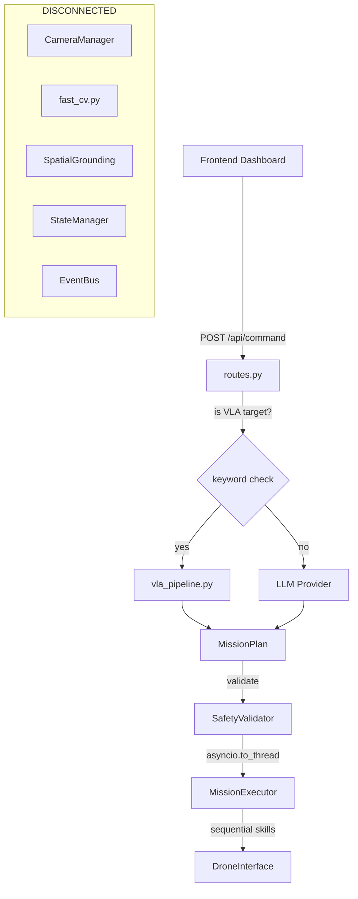
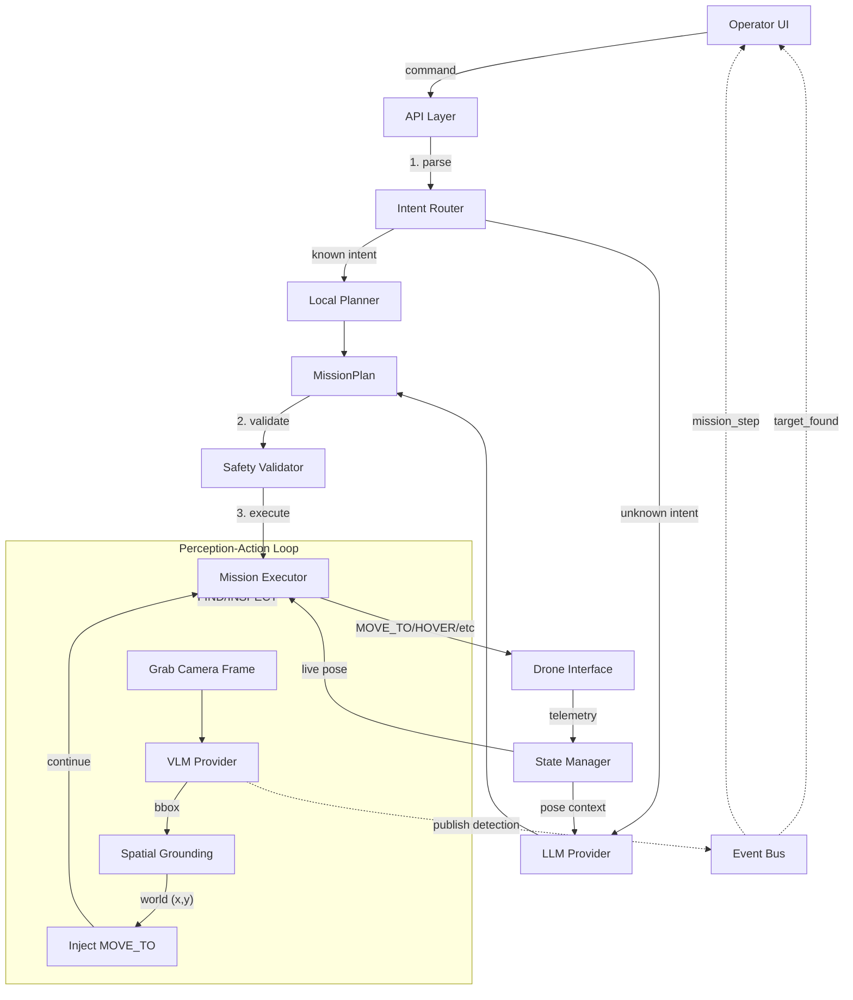

# Codebase Audit — LLM-VLM Autonomous Drone Framework

Full audit of every file in the project. 40+ files read, every bug and gap documented.

---

## Part 1 — Bugs Found

### 🔴 CRITICAL (will crash or produce wrong behavior)

| # | File | Line | Bug | Impact |
|---|------|------|-----|--------|
| C1 | [routes.py](file:///d:/UG/B.TECH/7th/Project_phase1/backend/api/routes.py#L70) | 70 | **Hardcoded objects list** — `"objects": [{"label": "red_bottle", "x": 0.5, "y": 0.5}]` is always sent as context, even when VLM has detected real objects | LLM never knows actual object positions; always plans around phantom bottle |
| C2 | [routes.py](file:///d:/UG/B.TECH/7th/Project_phase1/backend/api/routes.py#L100) | 100 | **Fire-and-forget execution** — `asyncio.create_task(asyncio.to_thread(_run_and_finish, ...))` but no error propagation. If executor crashes, frontend never knows | Silent mission failures |
| C3 | [fast_cv.py](file:///d:/UG/B.TECH/7th/Project_phase1/backend/vision/fast_cv.py#L28) | 28-38 | **All detections are hardcoded mock** — `process_frame()` always returns the same two synthetic objects regardless of actual camera input | Vision pipeline is entirely fake |
| C4 | [state_manager.py](file:///d:/UG/B.TECH/7th/Project_phase1/backend/runtime/state_manager.py#L10) | 10 | **Says "thread-safe" but has no locks** — no `threading.Lock()` anywhere | Race conditions on telemetry updates during execution |
| C5 | [mission_executor.py](file:///d:/UG/B.TECH/7th/Project_phase1/backend/runtime/mission_executor.py#L72-L78) | 72-78 | **FIND/INSPECT skills are no-ops** — if no `(x,y,z)` in params, just hovers for 1s instead of triggering VLM | "find the bottle" → hover briefly then move on, never actually searches |
| C6 | [pysimverse_interface.py](file:///d:/UG/B.TECH/7th/Project_phase1/backend/drone/pysimverse_interface.py#L187) | 187 | **`FlightMode.ERROR` doesn't exist** in telemetry schema — only `EMERGENCY` exists | Crash on emergency stop: `AttributeError: ERROR` |
| C7 | [gemini_provider.py](file:///d:/UG/B.TECH/7th/Project_phase1/backend/models/gemini_provider.py#L347-L356) | 347-356 | **Gemini `resolve_target()` always returns the same hardcoded bbox** — `(420,210)-(510,330)` regardless of image content | VLM via Gemini is 100% fake |

---

### 🟡 MODERATE (wrong behavior but won't crash)

| # | File | Line | Bug |
|---|------|------|-----|
| M1 | [camera_manager.py](file:///d:/UG/B.TECH/7th/Project_phase1/backend/vision/camera_manager.py) | all | **No `read_frame()` method** — can `start()` and `stop()` camera but never read a frame |
| M2 | [spatial_grounding.py](file:///d:/UG/B.TECH/7th/Project_phase1/backend/vision/spatial_grounding.py#L21) | 21 | **Hardcoded 640×480 mapping** — if webcam is 1280×720 or 360×240, homography produces wrong world coords |
| M3 | [event_bus.py](file:///d:/UG/B.TECH/7th/Project_phase1/backend/runtime/event_bus.py) | all | **EventBus exists but nobody uses it** — never instantiated, no listeners registered anywhere |
| M4 | [server.py](file:///d:/UG/B.TECH/7th/Project_phase1/backend/api/server.py) | 66 | **Only `llm` stored in context, not `vlm`** — when VLM ≠ LLM (our new split), VLAPipeline can't be referenced for bounding box queries during execution |
| M5 | [safety_validator.py](file:///d:/UG/B.TECH/7th/Project_phase1/backend/planning/safety_validator.py#L60-L63) | 60-63 | **CIRCLE only checks radius, not orbit center** — a CIRCLE at workspace edge with radius 0.5m breaches the geofence |
| M6 | [pysimverse_interface.py](file:///d:/UG/B.TECH/7th/Project_phase1/backend/drone/pysimverse_interface.py#L120-L164) | 120-164 | **Sequential axis movement** — moves Z, then X, then Y separately instead of diagonal. Causes L-shaped paths instead of straight lines |
| M7 | [plan_cache.py](file:///d:/UG/B.TECH/7th/Project_phase1/backend/planning/plan_cache.py#L85-L101) | 85-101 | **Template fill replaces all matching numbers** — "fly to 1m and hover 1s" → if cached with `z=1.0, t=1.0`, changing "2m" maps both z AND t to 2 |
| M8 | [routes.py](file:///d:/UG/B.TECH/7th/Project_phase1/backend/api/routes.py#L75) | 75 | **VLA dispatch keyword list is hardcoded** — `"bottle", "cube", "barrel"` etc. New objects won't trigger vision |

---

### 🟢 MINOR (cosmetic / technical debt)

| # | File | Issue |
|---|------|-------|
| m1 | [config.py](file:///d:/UG/B.TECH/7th/Project_phase1/backend/core/config.py) | `vlm_provider` and `llm_provider` settings exist but aren't read by `server.py` — `model_mode` comes from CLI only |
| m2 | [base_interface.py](file:///d:/UG/B.TECH/7th/Project_phase1/backend/drone/base_interface.py) | No `get_frame()` in abstract base — not enforced; each implementor adds it ad-hoc |
| m3 | All init files | Missing `__all__` exports in most `__init__.py` files |
| m4 | [qwen_provider.py](file:///d:/UG/B.TECH/7th/Project_phase1/backend/models/qwen_provider.py) | `_pattern_fallback()` duplicates `shape_paths.py` logic — dead code after intent routing fix |

---

## Part 2 — The Missing LLM ↔ VLM Communication

### Current State (Broken)

```
User Command ──► LLM.plan()
                    │
              skill list (FIND target="bottle")
                    │
              ──► Executor.execute_plan()
                    │
              FIND skill? → "if x,y,z in params: move_to(). else: hover(1s)"  ← ❌ NO VLM CALL
```

**The VLM is NEVER triggered by the LLM.** There is no connection between:
1. The LLM saying `FIND target="bottle"` 
2. The VLM doing `resolve_target(camera_frame, "bottle")`
3. The executor updating the plan with the VLM's detected position

### Who should trigger VLM?

**The Executor** — not the LLM. Here's why:

- LLM runs **once** before flight (planning phase)
- VLM must run **during flight** when camera sees the environment (execution phase)
- The LLM produces `FIND(target="bottle")` as an intent
- The Executor, upon hitting that skill, must:
  1. Grab camera frame from drone
  2. Call `vlm.resolve_target(frame, "bottle")`
  3. Get `(world_x, world_y)` via SpatialGrounding
  4. Inject a new `MOVE_TO(x, y, z)` into the remaining plan
  5. Continue execution

This is the **perception-action loop** that's completely missing.

---

## Part 3 — Architecture for a General Framework

### Current Architecture (as-built)



> [!CAUTION]
> **5 modules are completely disconnected**: CameraManager, FastPerception, SpatialGrounding, StateManager, EventBus. They exist as dead code.

### Proposed Architecture (General Framework)



---

## Part 4 — What to Fix (Prioritized)

### Phase 1: Wire the perception-action loop (CRITICAL)

| Change | File | What |
|--------|------|------|
| 1a | [mission_executor.py](file:///d:/UG/B.TECH/7th/Project_phase1/backend/runtime/mission_executor.py#L72-L78) | FIND/INSPECT → grab frame → call VLM → get world coords → inject MOVE_TO |
| 1b | [routes.py](file:///d:/UG/B.TECH/7th/Project_phase1/backend/api/routes.py#L70) | Replace hardcoded objects with live StateManager data |
| 1c | [server.py](file:///d:/UG/B.TECH/7th/Project_phase1/backend/api/server.py) | Store `vlm` separately in app_context, pass to executor |
| 1d | [state_manager.py](file:///d:/UG/B.TECH/7th/Project_phase1/backend/runtime/state_manager.py) | Add threading.Lock, connect to drone telemetry loop |
| 1e | [camera_manager.py](file:///d:/UG/B.TECH/7th/Project_phase1/backend/vision/camera_manager.py) | Add `read_frame()` method |

### Phase 2: Fix active bugs

| Change | File | What |
|--------|------|------|
| 2a | [pysimverse_interface.py](file:///d:/UG/B.TECH/7th/Project_phase1/backend/drone/pysimverse_interface.py#L187) | `FlightMode.ERROR` → `FlightMode.EMERGENCY` |
| 2b | [fast_cv.py](file:///d:/UG/B.TECH/7th/Project_phase1/backend/vision/fast_cv.py) | Replace hardcoded mocks with actual frame processing |
| 2c | [spatial_grounding.py](file:///d:/UG/B.TECH/7th/Project_phase1/backend/vision/spatial_grounding.py) | Accept dynamic image resolution |
| 2d | [safety_validator.py](file:///d:/UG/B.TECH/7th/Project_phase1/backend/planning/safety_validator.py) | Validate CIRCLE center + radius vs geofence |

### Phase 3: Generalize the framework

| Change | File | What |
|--------|------|------|
| 3a | [event_bus.py](file:///d:/UG/B.TECH/7th/Project_phase1/backend/runtime/event_bus.py) | Wire up: executor publishes `step_complete`, `target_found`, `mission_done` |
| 3b | [base_interface.py](file:///d:/UG/B.TECH/7th/Project_phase1/backend/drone/base_interface.py) | Add `get_frame() → Optional[ndarray]` to abstract base |
| 3c | [routes.py](file:///d:/UG/B.TECH/7th/Project_phase1/backend/api/routes.py#L75) | Remove hardcoded VLA keyword check — use intent router instead |
| 3d | new file | Create `ReplanManager` — monitors execution, triggers LLM replan when VLM detects unexpected obstacle or target moved |
| 3e | [config.py](file:///d:/UG/B.TECH/7th/Project_phase1/backend/core/config.py) | Read `llm_provider`/`vlm_provider` settings so they can be set in `.env` |

### Phase 4: Clean up dead code

| Action | File |
|--------|------|
| Remove | `_pattern_fallback()` in qwen_provider (duplicates shape_paths) |
| Remove | Hardcoded mock objects in fast_cv.py |
| Remove | Hardcoded VLM bbox in gemini_provider.py |
| Update | qwen_provider dead VLM-as-LLM fallback code |

---

## Part 5 — The General Perception-Action Execution Loop

This is the core missing piece. When executor hits `FIND` or `INSPECT`:

```python
# In MissionExecutor.execute_plan():

elif skill in ["FIND", "INSPECT"]:
    target = params.get("target", "object")
    
    # 1. Grab live camera frame
    frame = self.drone.get_frame()
    
    # 2. Call VLM for visual grounding
    detection = self.vlm.resolve_target(frame_bytes, target)
    
    if detection and detection.bbox:
        # 3. Convert pixel bbox → world coordinates
        cx, cy = detection.bbox.center_pixel
        world_x, world_y, _ = self.grounding.pixel_to_world(cx, cy)
        
        # 4. Store in StateManager
        self.state_manager.update_object(detection)
        
        # 5. Publish event
        self.event_bus.publish("target_found", {
            "label": target, "x": world_x, "y": world_y
        })
        
        # 6. Navigate to target
        success = self.drone.move_to(world_x, world_y, current_z)
    else:
        # Target not found — rotate to scan, or continue
        self.drone.rotate(90)
        # retry detection...
```

> [!IMPORTANT]
> **This is the fundamental architecture that makes it a "general autonomous navigation framework"** — the LLM plans *what* to do, the VLM perceives *where* things are during flight, and the executor bridges them in real-time.

---

## Summary

| Category | Count |
|----------|-------|
| 🔴 Critical bugs | 7 |
| 🟡 Moderate bugs | 8 |
| 🟢 Minor issues | 4 |
| Dead/disconnected modules | 5 (CameraManager, FastPerception, SpatialGrounding, StateManager, EventBus) |
| Missing core feature | Perception-action loop (LLM↔VLM↔Executor communication) |

The codebase has solid schemas, good safety validation, and a clean skill DSL. The main gap is that **perception is completely disconnected from execution** — fixing that makes this a real autonomous navigation framework.

Shall I proceed with Phase 1 (wire the perception-action loop)?
